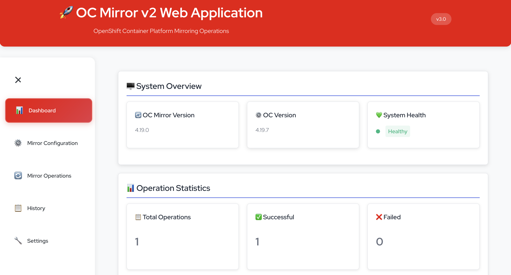
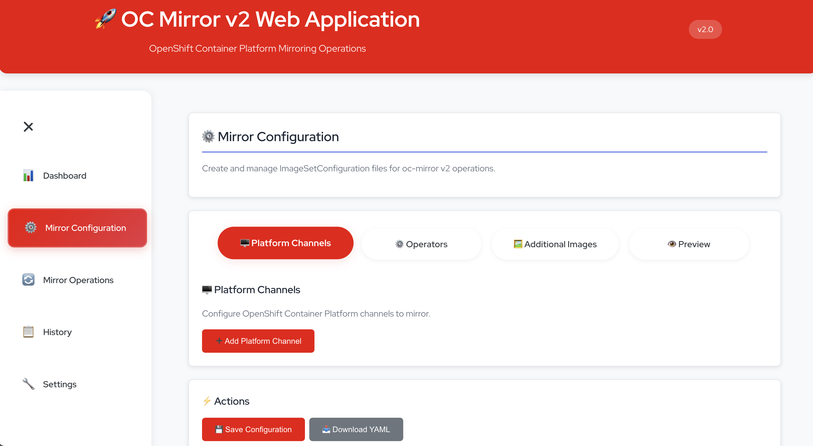
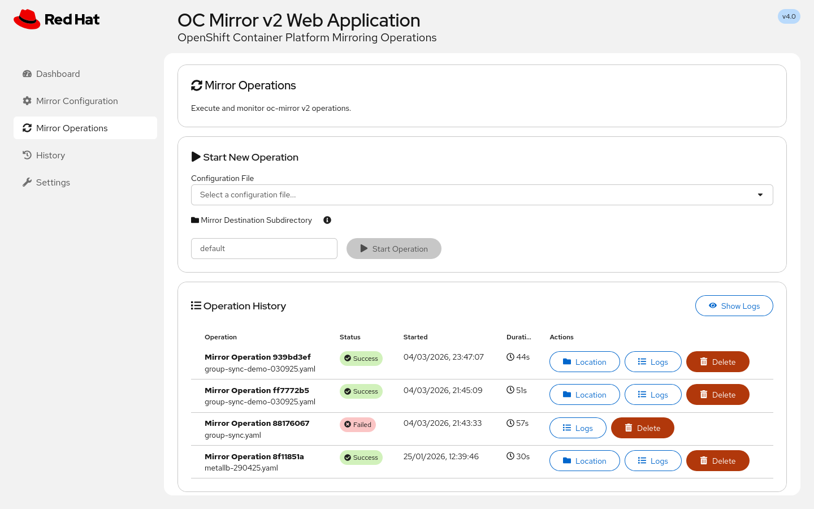

# OC Mirror v2 Web Application

A modern web-based interface for managing OpenShift Container Platform mirroring operations using oc-mirror v2. This application provides a user-friendly way to create, manage, and execute mirror configurations without requiring command-line expertise.

**Current Version: v3.2**

## 📋 Table of Contents

### 🚀 Getting Started
- [Quick Start (Containerized)](#-quick-start-containerized---no-host-dependencies)
  - [Prerequisites](#prerequisites)
  - [Clone and Navigate](#1-clone-and-navigate)
  - [Run with Container Script](#2-run-with-container-script-recommended)
  - [Access the Application](#3-access-the-application)
  - [Container Management](#container-management)
  - [Operator Catalog Fetching](#operator-catalog-fetching)

### 🔧 Alternative Deployment Options
- [Quay.io Images (quay-run.sh)](#alternative-quayio-images-quay-runsh)

### 📋 Features & Capabilities
- [Features](#-features)
  - [Core Functionality](#-core-functionality)
  - [Technical Features](#-technical-features)
  - [Security Features](#️-security-features)
- [Application Structure](#-application-structure)
- [Download System](#-download-system)
  - [Dynamic Progress Tracking](#dynamic-progress-tracking)
  - [Download Process](#download-process)
  - [Technical Implementation](#technical-implementation)

### 🔄 Technical Details
- [oc-mirror v2 Support](#-oc-mirror-v2-support)
  - [Supported Features](#-supported-features)
  - [Configuration Format](#-configuration-format)
  - [Configuration Features](#-configuration-features)

### 🎨 User Experience
- [User Interface](#-user-interface)
  - [Dashboard](#dashboard)
  - [Mirror Configuration](#mirror-configuration)
  - [Mirror Operations](#mirror-operations)
  - [History](#history)
  - [Settings](#settings)
- [Screenshots](#-screenshots)
  - [Dashboard](#dashboard-1)
  - [Mirror Configuration](#mirror-configuration-1)
  - [Mirror Operations](#mirror-operations-1)

### 📚 Documentation & Support
- [API Documentation](#-api-documentation)
- [Troubleshooting](#-troubleshooting)
- [Contributing](#-contributing)
- [License](#-license)
- [Support](#-support)

### 🔧 Compatibility & Requirements
- [Version Compatibility](#-version-compatibility)
  - [Supported oc-mirror Versions](#supported-oc-mirror-versions)
  - [Supported OpenShift Versions](#supported-openshift-versions)
  - [Deployment Options](#deployment-options)
  - [Container Runtime Requirements](#container-runtime-requirements)
  - [Architecture Support](#architecture-support)

---

## 🚀 Quick Start (Containerized - No Host Dependencies)

The easiest way to run this application is using containers. This approach requires **no installation** of Node.js, oc, or oc-mirror on your host system.

### Prerequisites

- **Podman** (required)
- **OpenShift pull-secret.json** (required to connect to Red Hat registries)

> **Note:** You must provide a valid `pull-secret.json` file (downloadable from https://console.redhat.com/openshift/downloads#tool-pull-secret) in order to mirror images from Red Hat registries.  This should be saved in the pull-secret directory.

### 1. Clone and Navigate

```bash
cd oc-mirror-web-app
```

### 2. Run with Container Script (Recommended)

> **🚨 IMPORTANT: First Run Requirement** 🚨
> 
> **For your first run, you MUST use the `--fetch-catalogs` flag to download operator catalogs:**
> 
> ```bash
> # Make the script executable
> chmod +x container-run.sh
> 
> # ⭐ FIRST RUN: Build and run with catalog fetching (REQUIRED)
> ./container-run.sh --fetch-catalogs
> ```
> 
> **Why is this important?**
> - The `--fetch-catalogs` flag downloads real operator catalog data for all OCP versions (4.16-4.20)
> - **Without this flag, the application will not work properly** - it requires the catalog data to function
> - This ensures you have access to the complete list of operators and their channels
> - Subsequent runs can use `./container-run.sh` (without the flag) for faster startup

The script automatically detects whether you have Podman and uses it.

The script will:
- ✅ Detect your container runtime (Podman)
- ✅ Check container runtime availability
- ✅ Create necessary data directories
- ✅ Build the container image (includes oc and oc-mirror v2)
- ✅ Start the containerized application with optimized settings
- ✅ Display access information

### 3. Access the Application

Once running, access the web interface at:
- **Web UI**: http://localhost:3000
- **API**: http://localhost:3001

### Container Management

```bash
# View logs
./container-run.sh --logs

# Stop the application
./container-run.sh --stop

# Build image only
./container-run.sh --build-only

# Run container only (assumes image exists)
./container-run.sh --run-only

# Check which container engine is detected
./container-run.sh --engine

# Build with catalog fetching
./container-run.sh --fetch-catalogs

# Build without fetching catalogs
./container-run.sh
```

The container now includes:
- **Multi-architecture support** for AMD64 and ARM64
- **Optimized environment variables** for better performance
- **Enhanced logging** with configurable log levels
- **Improved caching** for OC Mirror operations
- **Better error handling** and health checks
- **Pre-fetched operator catalogs** for OCP versions 4.16-4.20 (faster operator selection)
- **Multi-format catalog processing** for complete operator coverage
- **Automatic architecture detection** and display in system status
- **Persistent mirror storage** - mirror archives survive container restarts
- **Graceful container shutdown** - proper cleanup on stop
- **Docker HEALTHCHECK** support for container orchestration

### Operator Catalog Fetching

The application now pre-fetches operator catalogs for all supported OCP versions (4.16-4.20) during the build process. This provides:

- **Faster operator selection** - No need to query catalogs at runtime
- **Version-specific channels** - Each OCP version has its own operator catalog
- **Offline capability** - Works without internet access after build
- **Accurate channel information** - Real catalog data instead of static fallbacks
- **Enhanced compatibility** - Supports multiple catalog formats including index.yaml

**Build Options:**
- **Default (Fast)**: No catalog fetch (builds in 2-3 minutes)
- **Complete build**: Use `--fetch-catalogs` flag (takes 5-10 minutes, provides complete data)

**Supported Catalogs:**
- Red Hat Operator Index
- Certified Operator Index  
- Community Operator Index

**Catalog Processing:**
- **Multi-format support**: Handles catalog.json, index.json, index.yaml, package.json, and YAML formats
- **Robust extraction**: Gracefully handles non-standard operator structures
- **Complete coverage**: Processes all operators including edge cases like lightspeed-operator
- **Parallel processing**: Concurrent catalog fetching for faster build times
- **Automatic cleanup**: Container images cleaned up after extraction to save disk space
- **Incremental updates**: Skips fetching if catalogs are already fresh (7-day freshness check)

### Alternative: Quay.io Images (quay-run.sh)

For production deployments using pre-built images from Quay.io:

```bash
# Make the script executable
chmod +x quay-run.sh

# Start the application from Quay.io
./quay-run.sh

# View logs
./quay-run.sh --logs

# Stop the application
./quay-run.sh --stop

# Show status
./quay-run.sh --status

# Restart the application
./quay-run.sh --restart
```


[⬆️ Back to Top](#-table-of-contents)


## 📋 Features

### 🎯 Core Functionality
- **Configuration Management**: Create, edit, and manage mirror configurations
- **YAML Upload & Import**: Upload existing ImageSetConfiguration YAML files with validation and conflict resolution
- **Configuration Deletion**: Delete unwanted configuration files with confirmation dialogs
- **Smart Version Validation**: Real-time validation for platform and operator channel version ranges
- **Channel Compatibility Checking**: Ensures version ranges match selected channel versions
- **Auto-correction**: Automatically fixes invalid version ranges (min > max scenarios)
- **Operation Execution**: Run mirror operations with real-time monitoring
- **History Tracking**: View and analyze past operations
- **Log Management**: Centralized logging with search and filtering
- **Settings Management**: Configure application preferences
- **Multi-Architecture Support**: Automatic detection and support for AMD64 and ARM64
- **Enhanced Catalog Processing**: Multi-format support for all operator catalog types
- **Dynamic Download Progress**: Real-time progress bar for archive downloads with automatic modal management

### 🔧 Technical Features
- **Real-time Updates**: Live status updates during operations
- **File Management**: Upload, download, and manage configuration files
- **YAML Validation**: Comprehensive validation of uploaded ImageSetConfiguration files
- **Version Range Validation**: Smart validation for platform and operator channel version ranges
- **Channel Compatibility Validation**: Ensures version ranges match channel major.minor versions
- **Auto-correction Logic**: Automatically fixes invalid version ranges with user-friendly notifications
- **onBlur Validation**: Non-intrusive validation that doesn't interfere with typing
- **Conflict Resolution**: Smart handling of file conflicts with auto-rename and overwrite options
- **Error Handling**: Comprehensive error reporting and recovery
- **Responsive Design**: Works on desktop and mobile devices
- **RESTful API**: Full API for integration with other tools including upload and delete endpoints
- **Dynamic Operator Discovery**: Real-time query of operator catalogs
- **Smart Operator Selection**: Dropdown lists with dynamic operator packages and channels
- **Multi-Format Catalog Support**: Handles catalog.json, index.json, index.yaml, package.json, and YAML formats
- **Advanced Download System**: Polling-based progress tracking with robust error handling and automatic cleanup

### 🛡️ Security Features
- **Input Validation**: Comprehensive validation of all user inputs and configuration parameters
- **File Sanitization**: Secure file handling and processing with path validation
- **Error Isolation**: Operations are isolated to prevent system impact
- **Non-root Container**: Application runs as non-root user (node:1000) for enhanced security
- **Container Security**: Multi-stage builds with minimal attack surface
- **Network Security**: Secure communication between frontend and backend components
- **Data Protection**: Secure handling of pull secrets and sensitive configuration data

[⬆️ Back to Top](#-table-of-contents)

## 📁 Application Structure

```
oc-mirror-web-app/
├── src/                    # React frontend
│   ├── components/         # UI components
│   └── App.js             # Main application
├── server/                # Node.js backend
│   └── index.js           # API server
├── catalog-data/           # Pre-fetched operator catalogs
│   ├── redhat-operator-index/    # Red Hat operator data
│   ├── certified-operator-index/ # Certified operator data
│   ├── community-operator-index/ # Community operator data
│   └── catalog-index.json       # Master catalog index
├── data/                  # Persistent data (created automatically)
│   ├── configs/           # Mirror configurations
│   ├── operations/        # Operation history
│   ├── logs/             # Application logs
│   ├── cache/            # oc-mirror v2 cache
│   └── mirrors/          # Persistent mirror archives (survives restarts)
├── examples/              # Configuration examples
├── docs/                  # Documentation and screenshots
├── public/                # Static assets
├── pull-secret/           # Pull secret storage
├── .github/               # GitHub workflows and templates
├── Dockerfile            # Container definition
├── container-run.sh      # Easy container runner (Podman)
├── quay-run.sh           # Quay.io image runner
├── build-for-quay/       # Build and deployment scripts
│   └── build-for-quay.sh # Quay.io build and push script
├── fetch-catalogs-host.sh # Catalog fetching script
├── package.json          # Node.js dependencies
├── API.md                # API documentation
├── SUMMARY.md            # Feature summary
├── QUICKSTART.md         # Quick start guide
└── README.md             # This file
```

[⬆️ Back to Top](#-table-of-contents)

## 📁 Persistent Mirror Storage

### Mirror Archive Persistence
Mirror operations create persistent archives that survive container restarts:

- **Default Storage**: Mirror archives are saved to `data/mirrors/default/` by default
- **Custom Subdirectories**: Optionally specify a subdirectory name (e.g., `odf`, `production`)
- **Persistent Location**: Files are stored on the host filesystem and persist across container restarts
- **Location Display**: After operation completion, the UI shows the full host path to mirror files
- **Copy to Clipboard**: One-click copy of the mirror path for easy terminal access

### Storage Structure
```
data/mirrors/
├── default/          # Default mirror location
├── odf/             # Custom subdirectory example
└── production/      # Another custom subdirectory
```

### Using Custom Mirror Locations
When starting a mirror operation:
1. **Default**: Leave the subdirectory field empty → saves to `data/mirrors/default/`
2. **Custom**: Enter a subdirectory name (e.g., `odf`) → saves to `data/mirrors/odf/`
3. **Validation**: Subdirectory names are validated (alphanumeric, dashes, underscores only)
4. **Auto-creation**: Directories are created automatically with correct permissions

### Benefits
- **No Downloads Needed**: Mirror files are already on your host filesystem
- **Survives Restarts**: All mirror archives persist across container restarts
- **Easy Access**: Direct access to mirror files without browser downloads
- **Organized Storage**: Multiple mirror operations can use different subdirectories

[⬆️ Back to Top](#-table-of-contents)

## 🔄 oc-mirror v2 Support

This application is specifically designed for **oc-mirror v2**.

### ✅ Supported Features
- **Cache-based Storage**: Uses local cache for efficient operations
- **Improved Performance**: Faster mirroring operations
- **Better Error Handling**: Enhanced error reporting and recovery
- **Simplified Configuration**: Streamlined configuration format

### 📋 Configuration Format

The application generates clean oc-mirror v2 configurations:

```yaml
kind: ImageSetConfiguration
apiVersion: mirror.openshift.io/v2alpha1
mirror:
  platform:
    channels:
    - name: stable-4.18
      minVersion: "4.18.0"
      maxVersion: "4.18.10"
      shortestPath: true
    graph: true
  operators:
  - catalog: registry.redhat.io/redhat/redhat-operator-index:v4.18
    packages:
    - name: advanced-cluster-management
      channels:
      - name: release-2.8
        minVersion: "2.8.0"
        maxVersion: "2.8.0"
  additionalImages:
  - name: registry.redhat.io/ubi8/ubi:latest
```

### 📝 Configuration Features
- ✅ **Cache-based Storage**: Local cache for efficient operations
- ✅ **Direct Package Configuration**: Streamlined operator configuration
- ✅ **Enhanced Validation**: Better validation and error handling
- ✅ **Simplified Format**: Clean and readable configuration structure

[⬆️ Back to Top](#-table-of-contents)

## 🎨 User Interface

### Dashboard
- System status overview
- Recent operations
- Quick action buttons
- Resource usage statistics

### Mirror Configuration
- Visual configuration builder
- Template-based creation
- Import/export functionality
- Smart version range validation
- Channel compatibility checking
- Auto-correction for invalid ranges
- Real-time validation feedback
- Validation and preview

### Mirror Operations
- One-click operation execution
- Real-time progress monitoring
- Log streaming
- Operation cancellation
- **YAML Upload Section**: Clean inline interface for uploading existing ImageSetConfiguration files
- **Configuration Management**: Delete unwanted configuration files with professional confirmation dialogs
- **Persistent Mirror Storage**: Mirror archives saved to host filesystem, survive container restarts
- **Mirror Location Display**: Shows full host path to mirror files with copy-to-clipboard functionality
- **Toast Notifications**: Non-intrusive notifications for operation completion
- **Robust Error Handling**: Graceful handling of operation failures and edge cases
- **Auto-scroll Navigation**: Seamless user flow from upload to operation execution

### History
- Comprehensive operation history
- Filtering and search
- Detailed operation analysis

### Settings
- Application configuration
- Registry credentials
- System preferences
- Maintenance tools

[⬆️ Back to Top](#-table-of-contents)

## 📸 Screenshots

### Dashboard


### Mirror Configuration


### Mirror Operations


[⬆️ Back to Top](#-table-of-contents)

## 📚 API Documentation

The application provides a comprehensive RESTful API at `http://localhost:3001/api/`. For detailed API documentation including all endpoints, request/response formats, and examples, see [API.md](API.md).

**Key Endpoints:**
- `GET /api/system/info` - System health check and information (includes architecture detection)
- `GET /api/stats` - Application statistics
- `GET /api/config/list` - List configurations
- `POST /api/config/save` - Create/save configuration
- `POST /api/config/upload` - Upload YAML configuration files with validation
- `DELETE /api/config/delete/:filename` - Delete configuration files with security validation
- `GET /api/operations` - List operations
- `POST /api/operations/start` - Start operation (with optional mirrorDestinationSubdir parameter)
- `GET /api/system/paths` - Get available system paths
- `GET /api/catalogs` - Get available operator catalogs
- `GET /api/operators` - Get available operators (dynamic discovery)
- `GET /api/operator-channels/:operator` - Get channels for specific operator (dynamic)

[⬆️ Back to Top](#-table-of-contents)

## 🤝 Contributing

1. Fork the repository
2. Create a feature branch
3. Make your changes
4. Test thoroughly
5. Submit a pull request

[⬆️ Back to Top](#-table-of-contents)

## 📄 License

This project is licensed under the MIT License - see the LICENSE file for details.

[⬆️ Back to Top](#-table-of-contents)

## 🔧 Troubleshooting

### Configuration Saving Issues

**Problem**: Popup shows "Failed to save configuration"

**Solution**: This is typically a directory permission issue. The container needs write access to the data directories.

```bash
# Fix directory permissions (recommended)
sudo chmod -R 755 data/

# Alternative: Make directories world-writable (less secure)
sudo chmod -R 777 data/
```

**Why this happens**: The container runs as the `node` user (UID 1000), but the data directories might be owned by `root` or have insufficient permissions. The `container-run.sh` script attempts to fix permissions automatically, but manual intervention may be required in some cases.

**Verification**: After fixing permissions, try saving a configuration again. The popup should show "Configuration saved successfully".

### Other Common Issues

For additional troubleshooting steps, see the [Troubleshooting section in QUICKSTART.md](QUICKSTART.md#-troubleshooting).

[⬆️ Back to Top](#-table-of-contents)

## 🆘 Support

For issues and questions:
1. Check the troubleshooting section in QUICKSTART.md
2. Review the application logs
3. Open an issue on GitHub

[⬆️ Back to Top](#-table-of-contents)

## 🔧 Version Compatibility

### Supported oc-mirror Versions
- **oc-mirror v2.x**: ✅ Fully supported

### Supported OpenShift Versions
- **OCP 4.16**: ✅ Supported
- **OCP 4.17**: ✅ Supported
- **OCP 4.18**: ✅ Supported
- **OCP 4.19**: ✅ Supported
- **OCP 4.20**: ✅ Supported

### Deployment Options
- **Local Build**: `./container-run.sh` - Build and run locally
- **Quay.io Images**: `./quay-run.sh` - Use pre-built images from Quay.io

### Container Runtime Requirements
- **Podman**: 4.0+ ✅ Required
- **Node.js**: 22 (included in container)

### Architecture Support
- **AMD64 (x86_64)**: ✅ Fully supported
- **ARM64 (aarch64)**: ✅ Fully supported

[⬆️ Back to Top](#-table-of-contents) 
