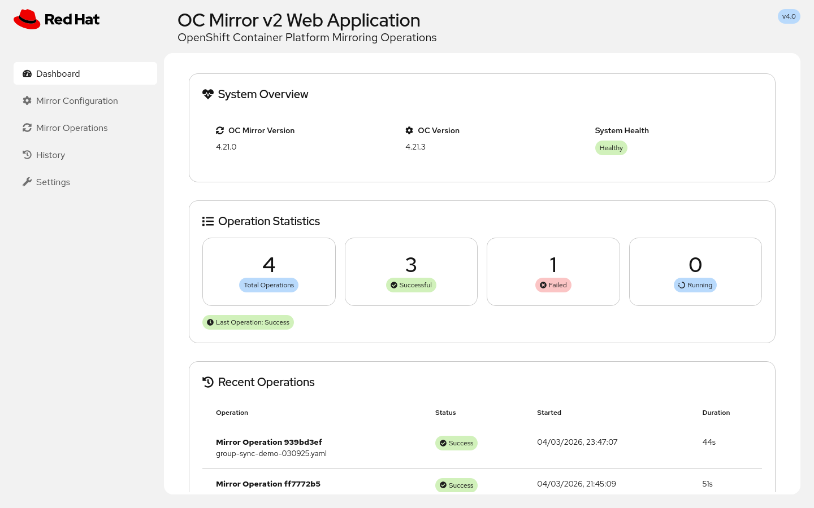
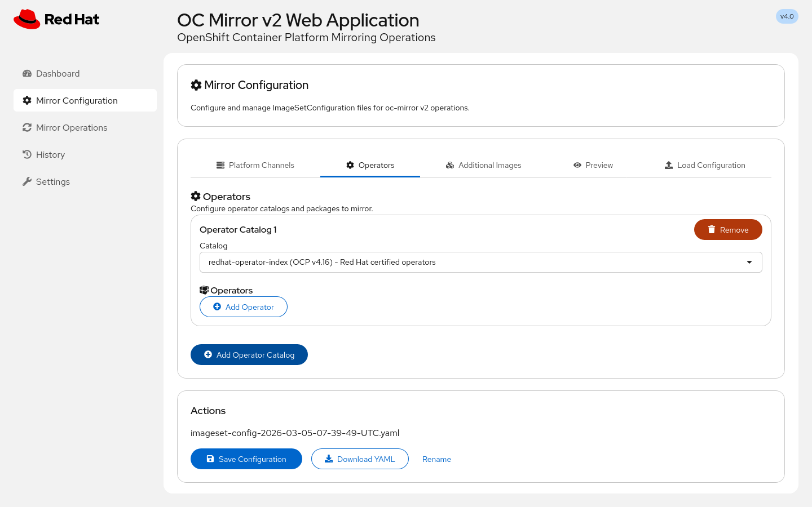
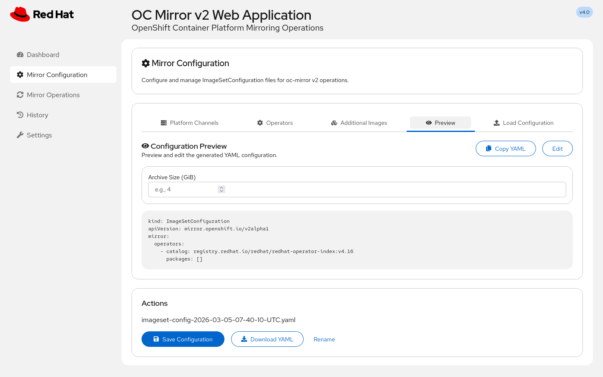
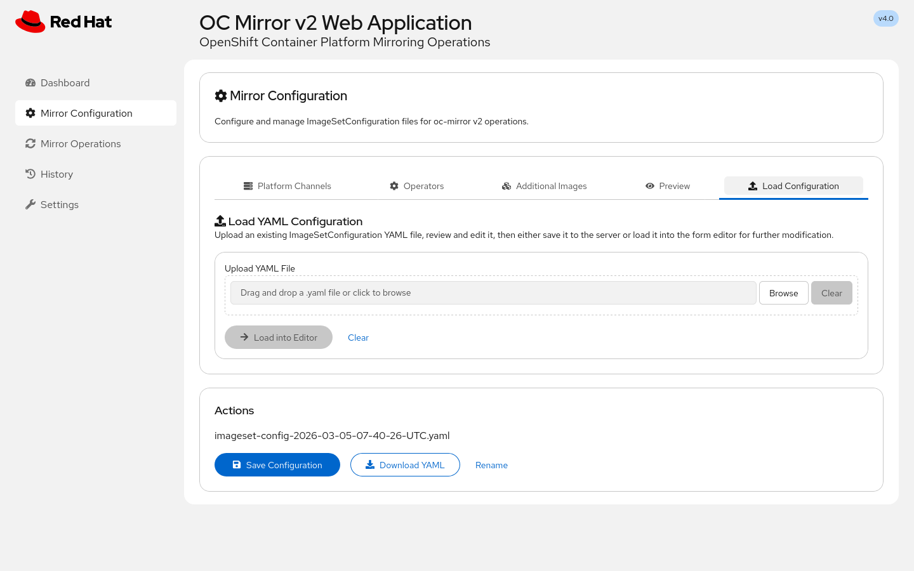
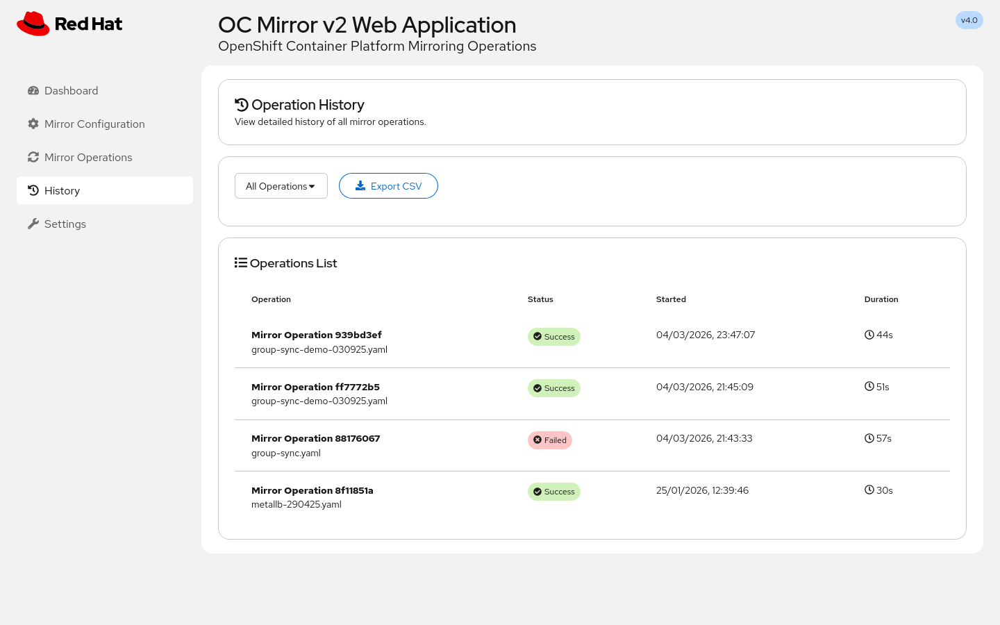
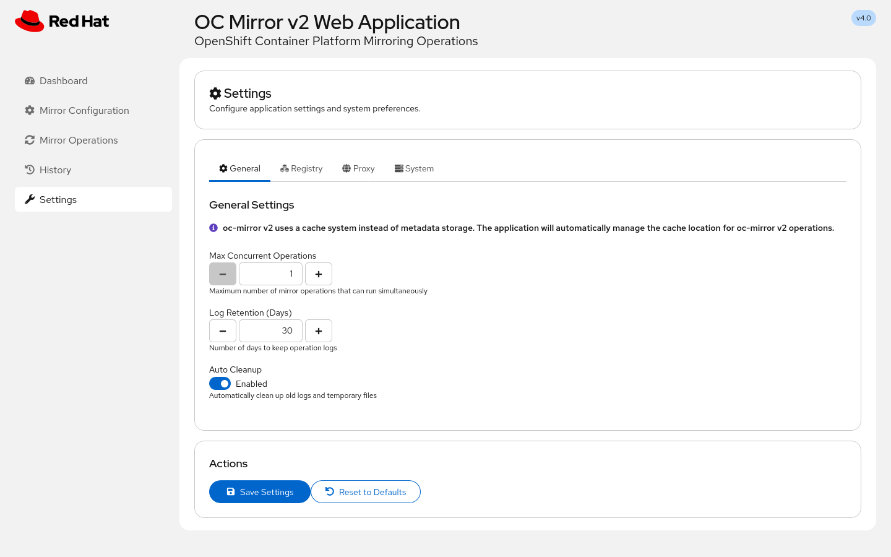

# OC Mirror v2 Web Application

A modern web-based interface for managing OpenShift Container Platform mirroring operations using oc-mirror v2. Create, manage, and execute mirror configurations without command-line expertise.



---

## Quick Start

### Prerequisites

- **Podman** (required)
- **Pull secret** from [console.redhat.com](https://console.redhat.com/openshift/downloads#tool-pull-secret) saved to `pull-secret/pull-secret.json`

### Clone the repository

```bash
git clone https://github.com/yakovbeder/oc-mirror-web-app.git
cd oc-mirror-web-app
```

### Option 1: Pre-built image (recommended)

```bash
chmod +x start-app.sh
./start-app.sh
```

The script auto-detects your architecture (AMD64/ARM64), pulls the image from Quay.io, and starts the app.
It validates `pull-secret/pull-secret.json` before launching the container.

Open the URL printed by the script in your browser. By default it uses **http://localhost:3000**, but it automatically selects another free host port if `3000` is already in use.

Manage with: `./start-app.sh --stop`, `./start-app.sh --restart`, `./start-app.sh --status`, `./start-app.sh --logs`.

### Option 2: Build locally

```bash
chmod +x container-run.sh

# Build and run locally (always fetches catalogs before the image build)
./container-run.sh

# Build only, without starting the container
./container-run.sh --build-only
```

Manage with: `./container-run.sh --stop`, `./container-run.sh --logs`, `./container-run.sh --build-only`.

Every `container-run.sh` build path performs the host-side catalog fetch before building the image. Use `./container-run.sh --run-only` only when you want to start an image that is already built locally.

---

## Features

### Dashboard

System health overview, operation statistics, recent operations, and quick action buttons.


### Mirror Configuration

Visual configuration builder with tabs for Platform Channels, Operators, Additional Images, YAML Preview, and file upload.

**Adding operators** -- Select from pre-fetched catalogs (OCP 4.16-4.21) with Red Hat, Certified, and Community operator indexes. Automatic dependency detection with one-click add.



**YAML preview and editing** -- Preview the generated `ImageSetConfiguration` YAML, copy to clipboard, or edit directly. Supports optional `archiveSize` parameter to limit archive file sizes.



**Upload existing YAML** -- Import existing `ImageSetConfiguration` files, review and edit them, then save to server or load into the form editor.



### Mirror Operations

Execute mirror operations with real-time monitoring. Select a configuration file, choose a destination subdirectory, and start. View operation history with logs, location info, and delete actions.


### History

Filter and review all past operations. Export to CSV.



### Settings

Configure general preferences, registry credentials, proxy settings, and system maintenance.



---

## Compatibility

| | |
|---|---|
| **oc-mirror** | v2.x |
| **OpenShift** | 4.16, 4.17, 4.18, 4.19, 4.20, 4.21 |
| **Container runtime** | Podman 4.0+ |
| **Architecture** | AMD64 (x86_64), ARM64 (aarch64) |

---

## Troubleshooting

**"Failed to save configuration"** -- Fix directory permissions: `sudo chmod -R 755 data/`

**Invalid GPG signature for operator index images** -- See [Red Hat KB article](https://access.redhat.com/solutions/6542281).

---

## API

Full RESTful API documentation is available in [API.md](API.md).

## Contributing

1. Fork the repository
2. Create a feature branch
3. Make your changes and test
4. Submit a pull request

## License

Apache License 2.0 -- see [LICENSE](LICENSE) for details.

## Related Tools

For getting your first OpenShift cluster up in a disconnected environment, see the [ABA project](https://github.com/sjbylo/aba/).
